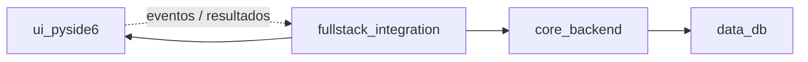

# Sistema de agentes — Extractor OCR

## Visión general

Este repositorio usa **agentes especializados** (definidos en `agents/`) y **skills reutilizables** (`skills/`) para que Cursor y otros asistentes trabajen con **responsabilidad única**, **menos tokens** y **menos ambigüedad**.

- **Entrada de la app**: `python -m app.main`
- **Stack**: Python 3.11+, PySide6, SQLite hoy; MySQL/InnoDB planificado (sin migración ejecutada aún).

Los subagentes **no duplican reglas**: delegan en skills. Antes de tareas grandes, elige el subagente adecuado y abre los skills enlazados.

---

## Principios de diseño

| Principio | Significado aquí |
|-----------|------------------|
| **Single responsibility** | Un cambio = un subagente principal; cruces mínimos UI ↔ core. |
| **Token efficiency** | Skills con checklists; prompts cortos; evitar pegar el repo entero. |
| **Explícito sobre implícito** | Límites de decisión en cada `.agent.md`; DB presente vs futuro en `skills/db_strategy_innodb.md`. |
| **Sin migración prematura** | SQLite sigue siendo la fuente de verdad hasta decisión explícita de migrar. |

---

## Subagentes (cuándo usar cuál)

| Subagente | Rol | Archivo |
|-----------|-----|---------|
| **UI PySide6** | Ventanas, widgets, temas, señales/slots, accesibilidad básica. | [`agents/ui_pyside6.agent.md`](agents/ui_pyside6.agent.md) |
| **Core / backend** | IA (OpenAI), parsing, recorte, exporters, lógica sin Qt. | [`agents/core_backend.agent.md`](agents/core_backend.agent.md) |
| **Integración full‑stack** | Contratos UI↔core, hilos/async, wiring en `main_window`, flujos end‑to‑end. | [`agents/fullstack_integration.agent.md`](agents/fullstack_integration.agent.md) |
| **Datos / DB** | Acceso a datos, SQLite hoy; diseño y compatibilidad hacia MySQL/InnoDB **sin ejecutar migración**. | [`agents/data_db.agent.md`](agents/data_db.agent.md) |

**Cuándo NO forzar subagentes**: cambios triviales de una línea o solo documentación pueden hacerse sin invocar un rol; igual conviene alinear el skill de estilo.

---

## Flujo de colaboración

1. **Feature con pantalla nueva o flujo nuevo** → empieza **Integración** (contrato); luego **UI** o **Core** según dónde caiga el grueso del trabajo.
2. **Solo lógica / IA / export** → **Core**; tocar **Datos** si el contrato de persistencia cambia.
3. **Solo widgets/temas** → **UI** sin tocar SQL salvo que la UI exponga campos nuevos acordados con **Datos**.

---

## Mapa subagentes ↔ skills

| Skill | UI | Core | Integración | Datos |
|-------|:--:|:----:|:-------------:|:-----:|
| [`skills/ui_pyside6.md`](skills/ui_pyside6.md) | ● | | ○ | |
| [`skills/core_ocr_pipeline.md`](skills/core_ocr_pipeline.md) | | ● | ○ | ○ |
| [`skills/data_access_layer.md`](skills/data_access_layer.md) | | ○ | ○ | ● |
| [`skills/db_strategy_innodb.md`](skills/db_strategy_innodb.md) | | | ○ | ● |
| [`skills/testing_python.md`](skills/testing_python.md) | ○ | ○ | ● | ○ |
| [`skills/security_privacy.md`](skills/security_privacy.md) | ○ | ● | ● | ● |
| [`skills/token_efficiency.md`](skills/token_efficiency.md) | ● | ● | ● | ● |
| [`skills/code_style_python.md`](skills/code_style_python.md) | ● | ● | ● | ● |

● = aplica con frecuencia · ○ = aplica si el cambio lo exige

---

## Convenciones del repo

### Alcance de cambios

- Tocar solo archivos necesarios; no refactor masivo no solicitado.
- **UI**: `app/ui/` (p. ej. `main_window.py`, `themes.py`, `panels/`, `image_viewer.py`).
- **Core**: `app/core/` (`ai_client.py`, `parsing.py`, `crop_tools.py`, `exporters.py`, `repository.py`, `models.py`, …).
- **Config**: `app/config.py` — cambios coordinados con quien use esas constantes.
- **Legacy**: `extraccion_ocr.py` — solo si el alcance lo pide; no divergir del contrato de la app sin motivo.

### Definition of Done

- [ ] Comportamiento acordado implementado sin romper flujos existentes.
- [ ] Sin secretos en código o commits; `.env` local.
- [ ] Tests relevantes actualizados o nuevos (`pytest tests/ -v` donde aplique).
- [ ] Si afecta DB: capa de acceso clara; **no** asumir MySQL hasta migración explícita.

### Testing mínimo

- Ejecutar `pytest tests/ -v` tras cambios en core o datos.
- UI: prueba manual mínima del flujo (abrir imagen, recorte, enviar, guardar) cuando se toque flujo crítico.

### Secretos y configuración

- `OPENAI_API_KEY` y similares vía `.env`; ver [`skills/security_privacy.md`](skills/security_privacy.md).

---

## Database Strategy (Presente y Futuro)

### SQLite (actual)

- Base de datos de aplicación según `app/config.py` (`DB_PATH` → `app/data/db.sqlite3`).
- **Datos** y **Core** usan el repositorio/capa de acceso existente (`app/core/repository.py` y relacionados).
- Migraciones o esquema: solo con cambios explícitos y tests.

### MySQL / InnoDB (planeado)

- Entorno de referencia: CyberPanel; base de datos objetivo: **`tools_OCR`** (InnoDB).
- **No ejecutar** migración ni cambiar el driver por defecto hasta decisión de producto y tarea dedicada.
- Hasta entonces: diseñar **DAL** y tipos de forma que un futuro backend MySQL pueda sustituir implementación sin reescribir UI ni prompts.

### Rol de los subagentes frente a la DB

| Subagente | SQLite hoy | MySQL futuro |
|-----------|------------|--------------|
| **Datos** | Implementa y mantiene acceso y esquema local. | Define interfaces y notas de compatibilidad InnoDB; **no** despliega solo. |
| **Core** | Consume repositorio/modelos. | Sin SQL directo en lógica de negocio; mismo contrato hacia la capa de datos. |
| **UI** | Sin SQL; solo modelos/DTOs expuestos por core o señales. | Igual. |
| **Integración** | Orquesta llamadas; sin strings SQL. | Verifica que hilos y errores sigan siendo seguros al cambiar backend. |

Detalle: [`skills/db_strategy_innodb.md`](skills/db_strategy_innodb.md) y [`skills/data_access_layer.md`](skills/data_access_layer.md).

---

## Inicio rápido para un agente

1. Identificar subagente → abrir su `agents/*.agent.md`.
2. Cargar skills marcados allí (y tabla arriba).
3. Usar prompts cortos del skill `token_efficiency`.
4. Cerrar con DoD y pytest cuando corresponda.
