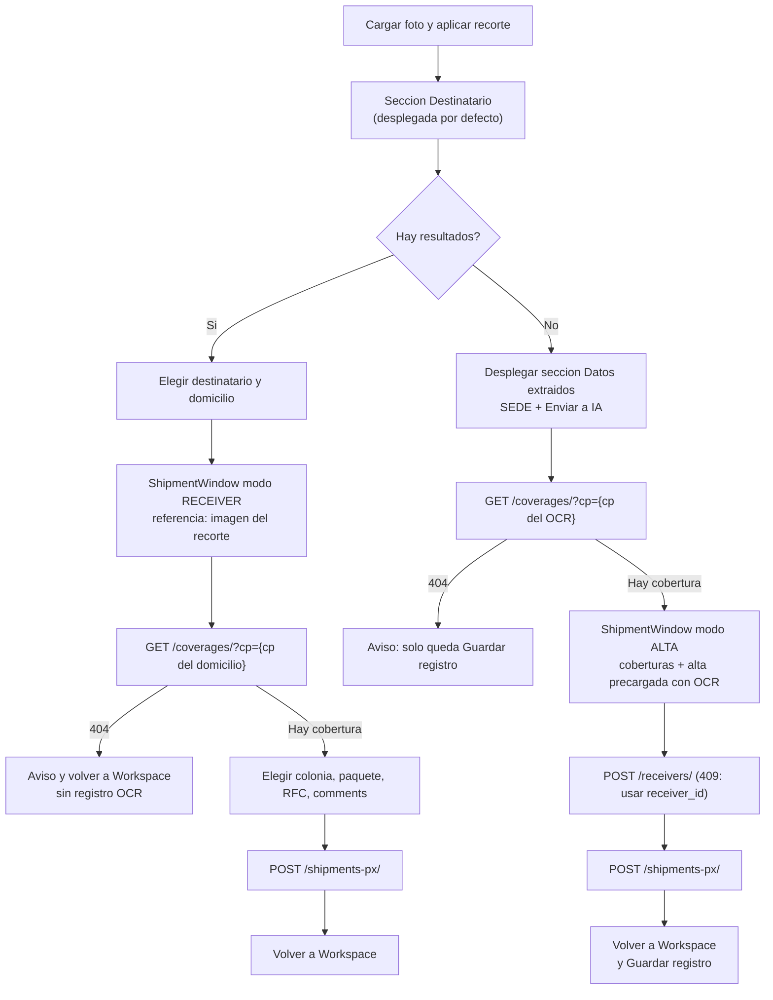

# Flujo objetivo en la interfaz

```mermaid
flowchart TD
  A["Cargar foto y aplicar recorte"] --> B["Seccion Destinatario<br/>(desplegada por defecto)"]
  B --> C{"Hay resultados?"}
  C -->|Si| D["Elegir destinatario y domicilio"]
  D --> E["ShipmentWindow modo RECEIVER<br/>referencia: imagen del recorte"]
  E --> F["GET /coverages/?cp={cp del domicilio}"]
  F -->|404| G["Aviso y volver a Workspace<br/>sin registro OCR"]
  F -->|Hay cobertura| H["Elegir colonia, paquete, RFC, comments"]
  H --> I["POST /shipments-px/"] --> J["Volver a Workspace"]
  C -->|No| K["Desplegar seccion Datos extraidos<br/>SEDE + Enviar a IA"]
  K --> L["GET /coverages/?cp={cp del OCR}"]
  L -->|404| M["Aviso: solo queda Guardar registro"]
  L -->|Hay cobertura| N["ShipmentWindow modo ALTA<br/>coberturas + alta precargada con OCR"]
  N --> O["POST /receivers/ (409: usar receiver_id)"]
  O --> P["POST /shipments-px/"] --> Q["Volver a Workspace<br/>y Guardar registro"]
```
